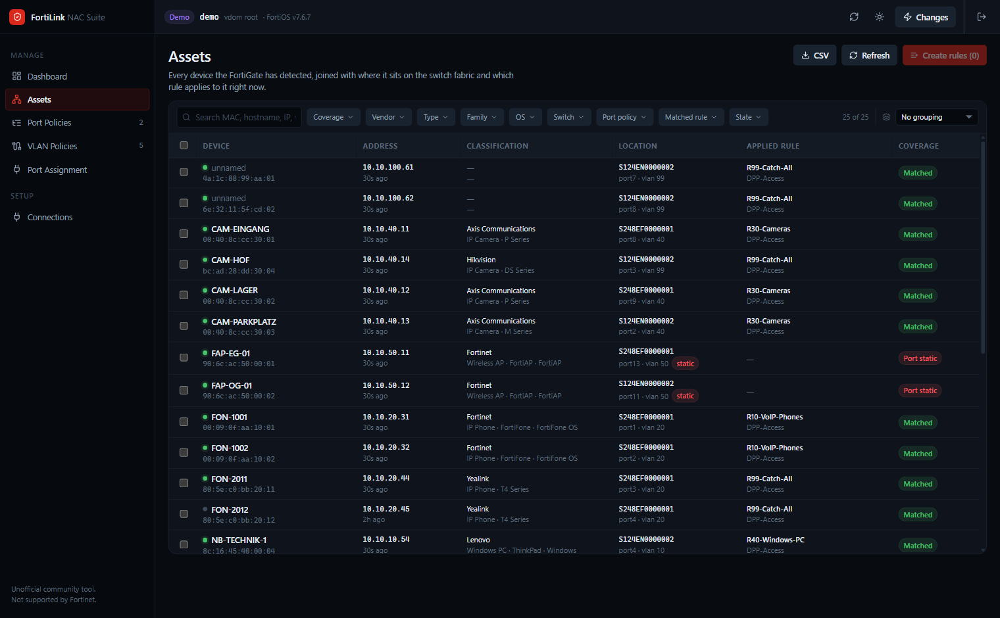
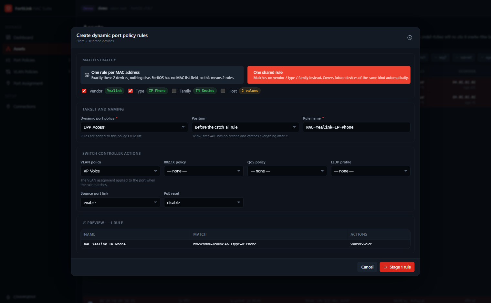
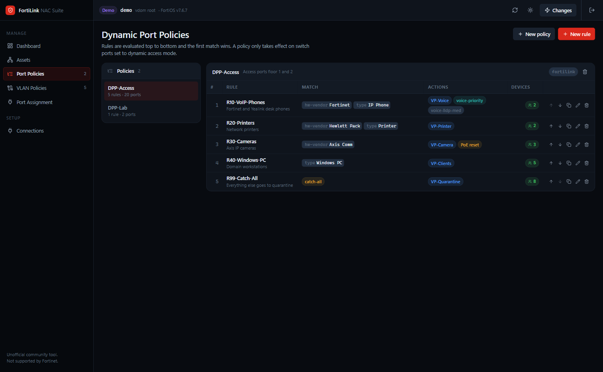
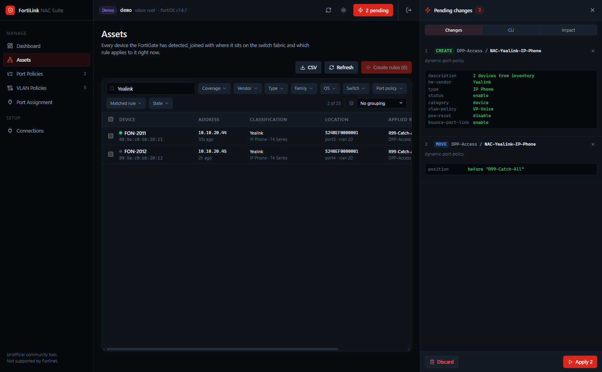
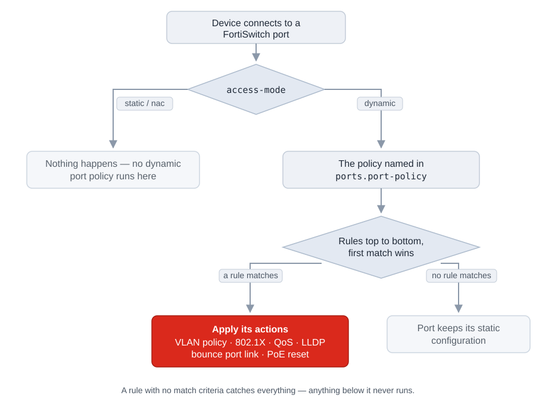
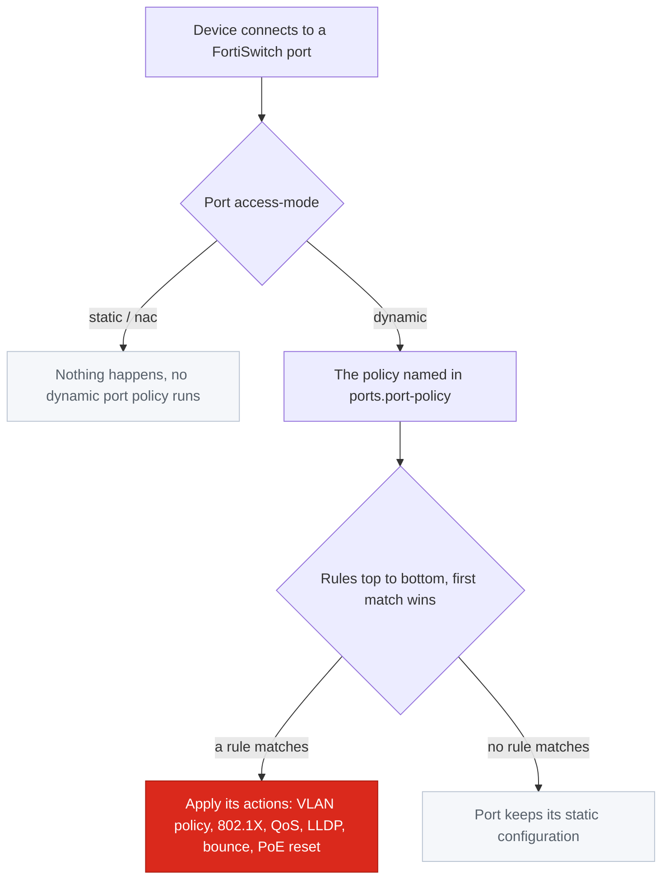

<p align="center">
  
</p>

<p align="center">
  <b>A management UI for FortiLink NAC dynamic port policies on FortiGate.</b><br>
  Asset inventory, policy rules and switch port assignment in one place — with a review step before anything is written.
</p>

<p align="center">
  
  
  
  
</p>

> [!IMPORTANT]
> **Unofficial community tool.** Not developed, endorsed or supported by Fortinet.
> Fortinet, FortiGate, FortiSwitch and FortiLink are trademarks of Fortinet, Inc.
> Use at your own risk, and read [Safety model](#safety-model) before pointing it at production.
>
> *Inoffizielles Community-Tool — nicht von Fortinet entwickelt, unterstützt oder gewartet.
> Nutzung auf eigene Gefahr.*

---

## Table of contents

- [Why this exists](#why-this-exists)
- [Screenshots](#screenshots)
- [How FortiLink NAC actually works](#how-fortilink-nac-actually-works)
- [Requirements](#requirements)
- [Getting started](#getting-started)
- [Configuration](#configuration)
- [Feature tour](#feature-tour)
- [Safety model](#safety-model)
- [The rule simulator](#the-rule-simulator)
- [FortiOS field reference](#fortios-field-reference)
- [API endpoints used](#api-endpoints-used)
- [Troubleshooting](#troubleshooting)
- [Development](#development)
- [Scope and roadmap](#scope-and-roadmap)
- [License](#license)

---

## Why this exists

FortiOS already has everything needed to do what people usually buy a separate NAC product for.
Its device detection knows every endpoint on the network, and **dynamic port policies** can
reconfigure a FortiSwitch port based on what is plugged into it — VLAN, 802.1X, QoS, LLDP, PoE reset.

What FortiOS lacks is a workflow. The three things you need to reason about live in three
different places:

| You want to know | FortiOS shows it under |
|---|---|
| What devices are out there | *User & Authentication → Device Inventory* |
| What rules exist | *WiFi & Switch Controller → Dynamic Port Policy* |
| Where those rules actually apply | *per-port*, inside each managed switch |

There is no filtering across the device inventory, no way to turn a set of devices into rules,
no preview of which rule will catch which device, and no review step before a change goes live.

This suite closes those gaps:

- **One table for the whole estate** — device identity, switch/port location and the currently
  applied rule, joined from three monitor endpoints.
- **Rules generated from devices**, not typed from memory — per MAC address or shared across
  vendor/type/family.
- **A simulator** that predicts which rule catches which device, and what a pending change
  would alter, before you apply it.
- **Nothing is written immediately.** Changes collect in a changeset with a field-level diff
  and the equivalent FortiOS CLI.

---

## Screenshots

**Asset inventory** — every detected device with its switch, port and the rule that currently applies.



**Rules from a selection** — per MAC address or shared across vendor and type, placed ahead of the
catch-all so they actually fire.



**Dynamic port policies** — rules in evaluation order, with a live count of matching devices.



**Review before applying** — field-level diff, equivalent CLI, and an impact preview.



---

## How FortiLink NAC actually works

Worth internalising, because most "my policy does nothing" problems come from one of these three facts.

<p align="center">
  
</p>

<details>
<summary>Same diagram as mermaid source</summary>



</details>

**1. A policy does nothing until a port opts in.**
A dynamic port policy only runs on ports where `access-mode` is `dynamic` **and** `port-policy`
names that policy:

```
config switch-controller managed-switch
    edit "S248EF0000001"
        config ports
            edit "port1"
                set access-mode dynamic
                set port-policy "DPP-Access"
            next
        end
    next
end
```

The suite surfaces this on the **Port Assignment** page, and the dashboard warns about policies
that are not assigned anywhere.

**2. First match wins.**
Rules inside a policy are evaluated top to bottom. A rule with no match criteria catches
*everything*, so anything below it is dead code. FortiOS appends new rules at the **end** — which
is exactly where they are useless if a catch-all already sits there. The suite defaults new rules
to a position *before* the catch-all and warns when rules would be shadowed.

**3. Match criteria are ANDed, and mostly prefix matches.**
Within one rule, every field you set must match. `mac` is an exact match; `hw-vendor`, `type`,
`family` and `host` are prefix matches, which is why the short 15-character limit on `hw-vendor`
is usually not a problem — `Hewlett Pack` matches `Hewlett Packard`.

---

## Requirements

- **FortiGate** with FortiLink-managed FortiSwitches.
  Developed and schema-validated against **FortiOS 7.6.7**; should work on 7.4+.
- **A REST API admin token** whose access profile grants the **`wifi`** access group —
  read for browsing, read-write to apply changes.
- **Node.js 20+**, or Docker.

### Creating the API token

```
config system accprofile
    edit "nac-suite"
        set wifi read-write          # read-only is enough for browsing
        set sysgrp read              # for system/interface and system status
    next
end

config system api-user
    edit "nac-suite"
        set accprofile "nac-suite"
        set vdom "root"
        config trusthost
            edit 1
                set ipv4-trusthost 10.0.0.0 255.255.255.0   # restrict to your host
            next
        end
    next
end

execute api-user generate-key nac-suite
```

Copy the generated key — FortiOS shows it exactly once.

> [!TIP]
> Start with `set wifi read` and a read-only connection profile. You can build a complete
> changeset and inspect the generated CLI without any write permission at all.

---

## Getting started

### Try it without a FortiGate

```bash
npm install
npm run dev
```

Open http://localhost:5273 and click **Explore with a demo FortiGate** (or enter `demo` as the host).

A built-in mock serves two FortiSwitches, 36 ports, 25 devices, two dynamic port policies and five
VLAN policies. It accepts writes, enforces the same referential rules as FortiOS (duplicate names,
`424` on missing dependencies, refusal to delete referenced objects), and re-evaluates rule matching
after every change — so the full plan-and-apply loop is exercised end to end. Nothing leaves your machine.

### Against a real FortiGate

```bash
npm install
npm run dev
```

Add a connection: host, API token, VDOM. Leave **read-only** on for the first look.

### Docker

```bash
docker run -d --name fortilink-nac-suite -p 4100:4100 -v fortilink-nac-data:/app/server/data -e FLNS_APP_PASSWORD=change-me -e FLNS_SECRET=change-me-too ghcr.io/xozy22/fortilinknacsuite:main
```

`FLNS_APP_PASSWORD` is not optional here. The container listens on all addresses so port
forwarding works, and the server refuses to start on a reachable address without a password —
see [Safety model](#safety-model).

### Docker Compose

```yaml
services:
  fortilink-nac-suite:
    image: ghcr.io/xozy22/fortilinknacsuite:main
    container_name: fortilink-nac-suite
    ports:
      - "4100:4100"
    volumes:
      - fortilink-nac-data:/app/server/data
    environment:
      FLNS_APP_PASSWORD: change-me     # required: the container listens on 0.0.0.0
      FLNS_SECRET: change-me-too       # encrypts stored API tokens, signs session cookies
      # Optional: start with a connection already established
      # FGT_HOST: fortigate.example.local
      # FGT_API_KEY: xxxxxxxxxxxxxxxx
      # FGT_VDOM: root
      # FGT_VERIFY_TLS: "false"
      # FGT_READ_ONLY: "true"
    restart: unless-stopped

volumes:
  fortilink-nac-data:
```

---

## Configuration

All configuration is environment variables on the **server**. Copy `server/.env.example` to
`server/.env` for local development.

| Variable | Default | Purpose |
|---|---|---|
| `FLNS_APP_PASSWORD` | — | Password for the UI itself. Without it the app is open to anyone who reaches the port. Required when listening on a non-loopback address. |
| `FLNS_BIND` | `127.0.0.1` | Address to listen on. The default keeps the app on this machine. The container image sets `0.0.0.0`. |
| `FLNS_ALLOW_ANONYMOUS` | `false` | Allow a non-loopback bind without a password — only when you have your own authentication in front. |
| `FLNS_COOKIE_SECURE` | `false` | Send the session cookie over HTTPS only. Set it behind a TLS proxy; over plain HTTP it would swallow the cookie. |
| `FLNS_PORT` | `4100` | Backend port. Deliberately **not** `PORT` — in development that belongs to the Vite dev server, and both would fight over it. |
| `FLNS_SECRET` | — | Encrypts stored API tokens at rest with AES-256-GCM and signs session cookies. Without it, tokens sit in `server/data/connections.json` in plain text and the cookie signing key is generated into `server/data/.session-key`. |
| `FLNS_DATA_DIR` | `server/data` | Where connection profiles are stored. |
| `FLNS_SCHEMA_FILE` | `./api-doku.json` | Offline CMDB schema fallback, used when the live schema cannot be fetched. |
| `FGT_HOST` | — | Optional: pre-configured connection, active without logging in. |
| `FGT_API_KEY` | — | Token for the pre-configured connection. |
| `FGT_VDOM` | `root` | VDOM for the pre-configured connection. |
| `FGT_VERIFY_TLS` | `false` | Verify the FortiGate certificate. Off by default because FortiGates ship self-signed certificates. |
| `FGT_READ_ONLY` | `true` | Block every write on the pre-configured connection. |

### Where the token lives

The API token is held **server-side only**. It is never sent to the browser: the connection list
API strips it, and every FortiGate call is made by the backend. The browser holds an `HttpOnly`
session cookie and nothing else.

The cookie is signed with HMAC-SHA256 and names only *which* connection profile is in use — the
token is looked up per request. That means sessions survive a server restart (a container update
does not log everyone out) without any session state on disk. Ad-hoc connections, where host and
token are typed in rather than saved as a profile, are held in memory and do not survive a restart.

---

## Feature tour

### Assets

The core view. One row per device, joined over the MAC address from three sources:

- `monitor/user/device/query` → identity (vendor, type, family, OS, hostname, IP, online state)
- `monitor/switch-controller/detected-device` → location (switch, port, VLAN)
- `monitor/switch-controller/matched-devices` → the rule the FortiGate actually applies

Plus the port's configured `access-mode` from the CMDB, so a device on a statically configured port
is visibly different from one that NAC simply has no rule for.

- Full-text search and nine facet filters (coverage, vendor, type, family, OS, switch, port policy,
  matched rule, online state), each showing counts under the other active filters
- Grouping by vendor, type, family, switch or coverage, and sortable columns
- A column picker offering the fields *this* firmware actually returns — the backend derives them
  from the response rather than hard-coding a list, so things like `purdue_level`,
  `dhcp_lease_status` or `host_src` are one click away
- CSV export of the current selection
- Multi-select → **Create rules**

**Coverage** is the column that matters:

| Badge | Meaning |
|---|---|
| `Matched` | A rule applies to this device. |
| `No rule` | The port runs NAC, but no rule matches. |
| `Port static` | The port is not in dynamic access mode — no policy can reach this device. |
| `Off switch` | Not seen on a FortiLink-managed switch port. |

### Create rules from a selection

Two strategies:

- **One rule per MAC address** — exactly the selected devices and nothing else. FortiOS has no
  MAC list field (`mac` is a single 17-character value), so *n* devices means *n* rules. The wizard
  names them from a shared prefix so the set can be filtered and removed together later.
- **One shared rule** — matches on vendor/type/family/host instead, and so covers future devices of
  the same kind. The wizard derives the common values from the selection, greys out fields that are
  ambiguous across it, and — importantly — **tells you which devices you did *not* select would also
  be caught** by the resulting rule.

Position defaults to *before the catch-all*, because a rule appended after one never fires.

Fortinet's own device templates (`monitor/switch-controller/known-nac-device-criteria-list`) are
available as a starting point in the rule editor.

### Replacing a device

When a device dies, its replacement has a different MAC address and every rule matching the old one
silently stops working. **Replace device** rewrites them in one step: enter or pick the old address,
pick the replacement, and every rule across every policy that matches the old MAC is restaged
against the new one. Only the `mac` field changes — name, VLAN policy and all other actions stay,
so the replacement is treated exactly like its predecessor.

Reachable from the Assets page and from any rule that matches on a MAC. The old device does **not**
have to be in the inventory — it is usually already unplugged — so the old address can also be
picked from the addresses currently used in rules.

Before staging anything it checks whether the rewritten rule can actually apply to the replacement:

- the replacement sits on a port that is not in dynamic access mode
- the replacement sits on a port running a *different* dynamic port policy than the rule lives in
- the new MAC is already matched by another rule, which would leave two rules competing
- the new MAC has not been seen by the FortiGate yet

### Port Policies

The policy list with, per policy, how many rules it holds and how many ports it is assigned to.
Per rule: match criteria, actions, and a live count of devices the simulator expects to match.

- Reorder with the arrow buttons (emits a FortiOS `move` operation, not a rewrite)
- Duplicate, edit, delete
- Unreachable rules are flagged inline and in the dashboard
- The rule editor derives every field, limit and option list from the CMDB schema, and shows a
  live list of the devices the current criteria would match

### VLAN Policies

Full CRUD for `switch-controller/vlan-policy` — the action a rule usually applies. Native VLAN,
allowed VLANs, untagged VLANs, discard mode. VLAN choices are filtered to the interfaces under the
selected FortiLink. The list shows which rules reference each policy, and deletion warns when a
policy is still in use.

### Port Assignment

Every port of every managed switch with its link state, description, `access-mode`, assigned policy,
tags, connected devices and the rule that matched there. Multi-select to switch ports to dynamic
access mode and attach a policy in one operation. Per port, a **bounce** action forces connected
devices to be re-evaluated.

The **Link** column keeps two things apart that FortiOS both calls "status":

| Shown as | Source | Meaning |
|---|---|---|
| `admin down` | CMDB `ports.status = down` | Disabled in the configuration. A policy can be attached, but nothing will happen there. |
| green dot + speed | Monitor `managed-switch/status` → `ports[].status` | Link is up. PoE draw is shown underneath when the port is delivering power. |
| grey dot + `down` | same | Port is enabled but nothing is connected. |
| `—` | — | No live status available, e.g. the monitor endpoint could not be read. |

Port descriptions come from the configuration (`ports.description`) and are searchable, so patch
panel labels like *"Buero 1.02 — Dose A"* are enough to find a port.

**Devices seen** is not just a count — hovering it (or focusing it with the keyboard) lists the
actual devices on that port with hostname, MAC, IP, classification, VLAN and the rule each one
matched. That matters because more than one device per port is the normal case in a voice
deployment: the desk phone and the PC behind it sit on the same port and are usually caught by two
different rules.

### Activity

Every write the tool performed, kept server-side in `server/data/audit.log` as one JSON object per
line: which operations ran, what each one returned, the equivalent CLI, the profile and VDOM, and
where the request came from. Failed sign-ins are recorded too. The apply report in the drawer is
gone after a reload — this is not.

### Dashboard

Devices detected, coverage percentage, ports under NAC, and matched device slots against the
FortiGate's hardware limit. Below that, the things worth acting on: policies assigned to no port,
rules shadowed by a catch-all, devices on static ports, devices with no rule, and unidentified
devices for which MAC matching is the only reliable option.

---

## Safety model

### Who can reach the app

Anyone who can reach the API can connect with a stored profile and write to your FortiGate. The
token stays on the server, but its *effect* does not. Two defaults follow from that:

- The server binds to **`127.0.0.1`** unless told otherwise.
- It **refuses to start** on any other address without `FLNS_APP_PASSWORD`, naming the three ways
  out (set a password, bind to loopback, or declare that you have your own authentication in front
  via `FLNS_ALLOW_ANONYMOUS`).

With a password set, every `/api` route including connection-profile management sits behind it.

### Before anything is written

Nothing in the UI writes to the FortiGate directly. Every edit produces an **operation** in a
changeset, and the changeset is applied only when you confirm it.

1. **Read-only profiles** block writes at the source — the changeset refuses the operation.
2. **Validation** runs against the live CMDB schema *and* the current configuration: field lengths,
   option lists, value ranges, missing referenced objects, duplicate names, table capacity limits,
   rules that would be unreachable, and rules that match everything or apply nothing.
3. **Dependency ordering.** VLAN policies are created before the rules that reference them; deletes
   run in reverse. Rule `move` operations run after the creates they reorder.
4. **Review.** A field-level diff, the equivalent FortiOS CLI block, and an impact preview showing
   exactly which devices change rule.
5. **Conflict detection.** Every modify re-reads the object immediately before writing. If it
   changed on the FortiGate since it was loaded here, the operation is **skipped**, not forced.
6. **Verification and revert.** Each operation reports its own result. If a batch fails partway,
   the operations that did succeed can be rolled back from their captured before-state.

The CLI preview is generated from the same operation list that is executed, so it is a faithful
description of the change — but applying uses the REST API, not the CLI. It exists for review and
for pasting into change records.

A staged changeset is kept in the browser per connection and VDOM, so an accidental reload does not
throw the work away. It is flagged as restored when it comes back, to make clear it was never
applied.

---

## The rule simulator

The simulator re-implements FortiOS rule evaluation client-side: first match wins within the policy
attached to the device's port, criteria ANDed, MAC exact, other fields prefix-matched, disabled
rules skipped.

It runs in two modes:

- **Reconciliation** — simulation against what `matched-devices` reports. Differences are surfaced
  on the Assets page rather than hidden, because they are informative: FortiOS re-evaluates a device
  when it reconnects or its port bounces, so a rule you changed an hour ago may not have taken effect yet.
- **What-if** — the changeset applied to a projected configuration, answering *"42 devices would match,
  7 change from rule A to rule B, 3 lose their match"* before you commit.

> [!NOTE]
> The simulator is an approximation and is labelled as such in the UI.
> `monitor/switch-controller/matched-devices` remains the authority, and the *Matched rule* column
> always shows what the FortiGate reports, never what the simulator predicts.

---

## FortiOS field reference

`switch-controller/dynamic-port-policy` → `policy` (the rule sub-table), as validated against the
7.6.7 schema. These limits are enforced in the UI before anything is sent.

| Field | Type | Limit | Notes |
|---|---|---|---|
| `name` | string | 63 | Key of the rule. Cannot be renamed in place. |
| `status` | option | `enable`/`disable` | |
| `category` | option | `device`/`interface-tag` | Switches which match block applies. |
| `mac` | string | **17** | Exact match, **one address per rule**. No list, no documented wildcard. |
| `hw-vendor` | string | **15** | Prefix match. Real vendor strings often exceed this — truncate. |
| `type` | string | **15** | Prefix match. |
| `family` | string | 31 | Prefix match. |
| `host` | string | 64 | Prefix match on the detected hostname. |
| `interface-tags` | table | — | `category = interface-tag` only. All listed tags must be on the port. |
| `vlan-policy` | ref | 63 | → `switch-controller/vlan-policy` |
| `802-1x` | ref | 31 | → `switch-controller.security-policy/802-1X` or `captive-portal` |
| `qos-policy` | ref | 63 | → `switch-controller.qos/qos-policy` |
| `lldp-profile` | ref | 63 | → `switch-controller/lldp-profile` |
| `bounce-port-link` | option | default `enable` | Bounces the port so the new VLAN takes effect. |
| `bounce-port-duration` | integer | 1–30 s | Default 5. |
| `poe-reset` | option | default `disable` | |
| `match-type` | option | `dynamic`/`override` | `override` retains the match for `match-period`. |
| `match-period` | integer | 0–120 days | 0 = retain forever. |

Capacity: **256** dynamic port policies and **256** VLAN policies per VDOM. The FortiGate also has a
hardware limit on total matched NAC devices, reported by `nac-device/stats` and shown on the dashboard.

> [!WARNING]
> **There is no interface `type` of `fortilink`.** The `type` options are `physical`, `vlan`,
> `aggregate`, `redundant`, `tunnel`, `loopback`, `switch`, and so on. Whether an interface carries
> FortiLink is the separate boolean field `system.interface.fortilink = enable`, typically on an
> `aggregate` interface. Filtering by type finds nothing.

---

## API endpoints used

Everything is read through the FortiGate REST API. No SSH, no CLI, no configuration file parsing.

**Read (monitor)**

| Endpoint | Used for |
|---|---|
| `GET monitor/system/status` | Connection test, hostname and version |
| `GET monitor/user/device/query` | Device inventory |
| `GET monitor/switch-controller/detected-device` | MAC → switch, port, VLAN |
| `GET monitor/switch-controller/matched-devices?include_dynamic=true` | The rule actually applied |
| `GET monitor/switch-controller/nac-device/stats` | Matched device count against the hardware limit |
| `GET monitor/switch-controller/known-nac-device-criteria-list` | Fortinet's device templates |
| `GET monitor/switch-controller/managed-switch/status` | Live link state, speed, duplex and PoE draw per port |
| `POST monitor/switch-controller/managed-switch/bounce-port` | Re-trigger evaluation on a port |

**Read (CMDB)**

`switch-controller/dynamic-port-policy` · `switch-controller/vlan-policy` ·
`switch-controller/managed-switch` · `switch-controller/lldp-profile` ·
`switch-controller/switch-interface-tag` · `switch-controller.qos/qos-policy` ·
`switch-controller.security-policy/802-1X` · `system/interface` · `cmdb/?action=schema`

**Write (CMDB)**

Only three tables, and only through the changeset:
`switch-controller/dynamic-port-policy` (including the `policy` child table and `action=move`),
`switch-controller/vlan-policy`, and `switch-controller/managed-switch` (the `ports` child table,
for `access-mode` and `port-policy` only).

---

## Troubleshooting

**`HTTP 403` on everything**
The API admin's access profile is missing the `wifi` access group, or the token is not permitted in
the selected VDOM. All `switch-controller` endpoints sit behind `wifi`.

**`HTTP 401`, though the token is right**
Check the API user's `trusthost` entries — the source IP of the *server*, not your browser, has to
be permitted.

**TLS handshake fails**
FortiGates present a self-signed certificate. Turn **Verify TLS certificate** off on the connection
profile, or install a trusted certificate on the FortiGate.

**The FortiLink interface list is empty**
The token cannot read `system/interface` in this VDOM. The field is still free-text, so you can type
the name; verify it with `show system interface | grep -f fortilink`.

**`HTTP 424` when applying**
A referenced object is missing or a value was rejected. Most often a VLAN policy that does not exist,
or a required `fortilink` that is unset. The changeset validates both beforehand — a 424 that gets
through usually means the object was removed on the FortiGate in the meantime.

**A rule exists but no device matches it**
In order: is the port in `access-mode dynamic`? Is that policy attached to the port? Is the rule
above the catch-all? Are the criteria prefix-correct? The dashboard and the policy list flag the
first three directly.

**A rule was changed but devices still show the old one**
Expected. FortiOS re-evaluates a device when it reconnects or the port bounces. Use the bounce
action on the Port Assignment page to force it.

---

## Development

```bash
npm install
npm run dev          # backend on 4100, frontend on 5273, both with hot reload
npm test             # vitest, server and web in one run
npm run test:watch   # same, in watch mode
npm run typecheck    # tsc --noEmit
npm run build        # production build of the frontend
npm start            # serve the built frontend from the backend
```

### Tests

The suite covers the parts where a mistake reaches the FortiGate or misleads the person reading
the screen: the changeset engine (validation, dependency ordering, apply, conflict detection,
revert), the CLI preview, the three-way inventory join including pagination and source failures,
the rule simulator and the pending-change projection.

The in-memory mock FortiGate doubles as the fixture, so `applyOps` is exercised against something
that enforces the same referential rules the appliance does. Several cases are regression tests for
bugs this project actually had — a rule appended behind the catch-all, and a conflict false alarm
from an incomplete snapshot.

### Layout

```
server/                Express backend — holds the API token and the TLS decision
  fortigate.js         REST client: bearer auth, VDOM, TLS toggle, error hints
  session.js           Signed session cookie, app password, bind safety check
  store.js             Connection profiles, optional AES-256-GCM token encryption
  schema.js            CMDB schema, live with offline fallback
  inventory.js         The three-way device join, paged
  changeset.js         Validation, dependency ordering, apply, conflict detection, revert
  cli.js               Operation list → FortiOS CLI text
  audit.js             Append-only activity log
  demo.js              In-memory mock FortiGate
  schema-fallback.json Trimmed CMDB schema (7 tables) used when the live one is unreachable
web/src/
  api/                 Typed client and React Query hooks
  lib/                 Simulator, schema validation, projection, operation builders, sorting
  components/          Change drawer, rule editor, bulk wizard, filter bar, fields, hover card
  pages/               Dashboard, Assets, Policies, VLAN Policies, Ports, Connections, Activity
scripts/trim-schema.mjs  Regenerates the schema fallback from a full FortiGate dump
```

### Regenerating the schema fallback

A full `?action=schema` dump is about 4 MB across 685 tables; this tool needs seven of them. The
committed fallback is the trimmed result, roughly 33 KB:

```bash
curl -k -H "Authorization: Bearer <token>" "https://<fortigate>/api/v2/cmdb/?action=schema" -o api-doku.json
node scripts/trim-schema.mjs
```

The raw dump is gitignored — it carries the serial number of the device it came from.

### Design notes

- **Validation is generated, not written.** Field lengths, option lists and value ranges come from
  the FortiGate's own CMDB schema, so they track the target firmware instead of drifting from the
  documentation. `api-doku.json` is the offline fallback when the live schema cannot be fetched.
- **Server state lives in React Query**, not in a global store. The FortiGate is the source of truth;
  the browser holds only the changeset.
- **Pending changes are projected onto the read state**, so a staged rule appears in the list
  immediately, marked as pending, at the position it will end up in.

---

## Scope and roadmap

**In scope today:** dynamic port policies, VLAN policies, port assignment, the asset inventory and
the plan-and-apply workflow.

**Not included:**

- The NAC device path — `user/nac-policy` and `switch-controller/mac-policy`
- Editors for 802.1X, QoS, LLDP, storm control and interface tag objects
  (these are selectable in rules, but created on the FortiGate)
- FortiSwitch firmware management and diagnostics
- Wireless / SSID policies

Contributions and issue reports are welcome.

---

## License

MIT — see [LICENSE](LICENSE).
